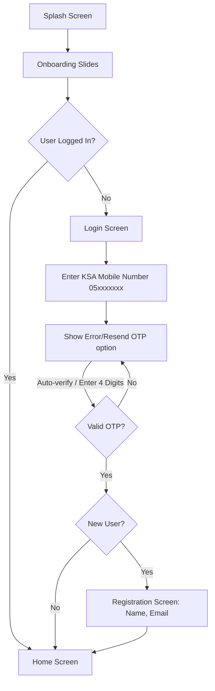
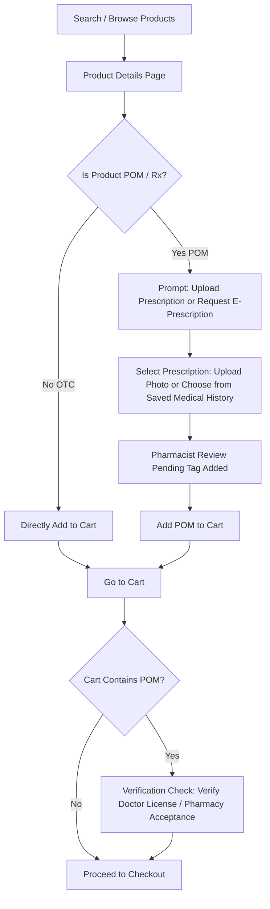
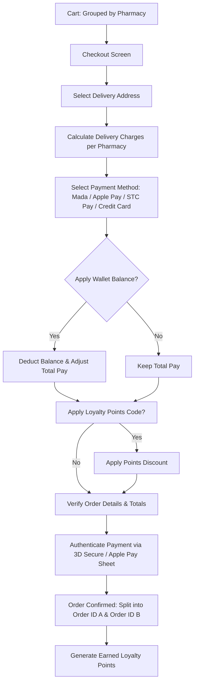
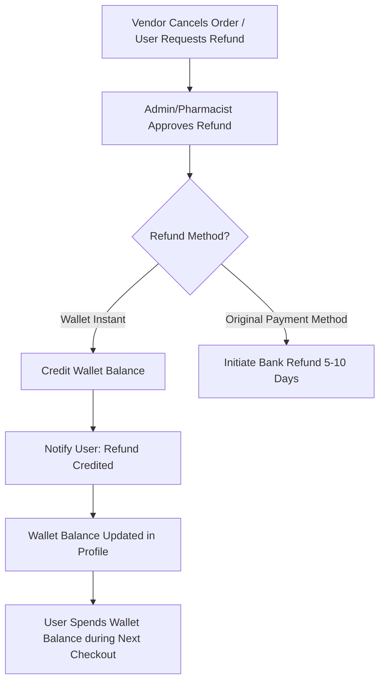

# YUSUR Consumer App — UX Audit, IA Review & User Flows

This document provides a comprehensive UX architecture analysis, information architecture review, user flows, and strategic recommendations for the YUSUR Consumer App. It is designed to align product, design, and engineering teams on KSA-specific healthcare e-commerce requirements.

---

## 1. Healthcare E-Commerce UX Audit

A standard multi-vendor e-commerce platform is insufficient for healthcare. In Saudi Arabia, digital health platforms are subject to strict regulations from the **Saudi Food and Drug Authority (SFDA)** and the **Ministry of Health (MOH)**. We have identified several critical gaps in the standard e-commerce scope that must be integrated into the UX architecture.

### Identified Gaps & Missing Business Cases

#### A. Prescription vs. Over-The-Counter (OTC) Classification
* **The Problem:** Prescription-Only Medicines (POM) cannot be sold and delivered without a valid doctor's prescription. OTC medicines can be checked out directly.
* **The Solution:** The app must support distinct product tags and checkout logic. POM items must trigger a "Prescription Upload & Verification Flow" before checkout can proceed.
* **UX Impact:** Visual tags (e.g., Rx badge in red/teal) and distinct cart behaviors.

#### B. SFDA & MOH Regulatory Compliance
* **The Problem:** The SFDA prohibits the advertising of prescription drugs directly to consumers. Product descriptions for POM must be strictly educational and non-promotional.
* **The Solution:** Clear segregation of promotions (banners can only advertise OTC, cosmetics, or wellness products, never prescription drugs).
* **UX Impact:** Dynamic banner moderation and product detail layout adjustments depending on the drug classification.

#### C. Health Insurance Co-Payment Integration
* **The Problem:** Healthcare consumers in Saudi Arabia expect to use their health insurance (e.g., Tawuniya, Bupa, Medgulf) for pharmacy orders, especially for chronic medications.
* **The Solution:** An insurance verification flow where users scan/enter their insurance card, the system estimates the co-payment percentage (e.g., 10% or 20%), and requests approval.
* **UX Impact:** "Pay with Insurance" option at checkout, insurance card OCR scanner in the profile, and real-time co-pay calculation.

#### D. Cold-Chain Logistics & Delivery Integrity
* **The Problem:** Temperature-sensitive medications (like insulin, vaccines, or specific eye drops) lose efficacy if exposed to Saudi heat.
* **The Solution:** Products requiring cold chain must be flagged. The checkout must default to temperature-controlled delivery partners (e.g., refrigerated boxes) and charge appropriate logistics fees.
* **UX Impact:** "Requires Cold-Chain" icon on product detail and cart, and a dedicated cold-chain delivery badge.

#### E. Pharmacist Consultation & Counseling
* **The Problem:** Elderly patients or families may not understand drug dosages, drug-to-drug interactions, or correct usage instructions.
* **The Solution:** A dedicated chat or voice call button connected to a licensed pharmacist before checkout or directly from the order details screen.
* **UX Impact:** "Ask a Pharmacist" floating action button (FAB) or widget on POM product pages and order tracking.

#### F. Split Delivery & Dynamic Shipping Fees
* **The Problem:** In a multi-vendor marketplace, a single cart containing items from Pharmacy A and Pharmacy B results in two separate deliveries.
* **The Solution:** Clear communication of separate delivery times, courier fees, and minimum order requirements for each pharmacy in the cart.
* **UX Impact:** Grouping by pharmacy in the cart, split delivery charge breakdown in the price summary, and split-order tracking timelines.

---

## 2. Information Architecture (IA) Review

The YUSUR Consumer App navigation architecture is mobile-first, utilizing a standard 5-tab bottom navigation. Below is the structured layout mapping.

```
+-----------------------------------------------------------------------------------+
|                                 YUSUR CONSUMER APP                                |
+-----------------------------------------------------------------------------------+
                                         │
       ┌───────────────┬─────────────────┼────────────────┬──────────────┐
       ▼               ▼                 ▼                ▼              ▼
   [ 1. Home ]   [ 2. Pharmacies ]   [ 3. Cart ]    [ 4. Orders ]  [ 5. Profile ]
       │               │                 │                │              │
       ├─ Location     ├─ Map View       ├─ Grouped by    ├─ Active      ├─ Personal Info
       ├─ Global Search├─ Nearby List    │  Pharmacy      ├─ History     ├─ Addresses
       ├─ Banners      ├─ Detail & Rx    ├─ Coupon Code   └─ Tracking    ├─ Wishlist
       ├─ Categories   ├─ Branches       ├─ Price Split                  ├─ Wallet
       ├─ Featured     └─ Reviews        └─ Checkout CTA                 ├─ Loyalty Points
       ├─ Best Sellers                                                   ├─ Support / FAQs
       └─ Offers                                                         └─ Language Toggle
```

### RTL (Arabic) & LTR (English) Navigation Mechanics
* **Bi-directional Layout Rules:** When the user switches to Arabic (RTL):
  - The navigation bar order reverses: Home starts on the right, Profile on the left.
  - Form fields, chevron icons, and sliders mirror orientation.
  - Rating stars, phone inputs (+966), and numeric price layouts remain standard but aligned block-end/block-start.
* **CSS Spacing System:** Use logical properties rather than absolute coordinates:
  - `margin-inline-start` instead of `margin-left`
  - `padding-inline-end` instead of `padding-right`
  - `inset-inline-start` instead of `left`
  - Text alignment uses `text-align: start` and `text-align: end`.

---

## 3. User Flow Review

We have mapped the critical user journeys to ensure friction-free e-commerce transitions.

### A. Onboarding, Authentication & OTP Verification
KSA mobile number formatting must be validated (+966 or 05xxxxxxx). The OTP flow uses auto-fill capabilities.



### B. Product Discovery to Checkout (OTC vs. Prescription Split)
This flow highlights how the application handles the complex split when a user adds a Prescription-Only Medicine (POM) to their cart.



### C. Checkout & Multi-Vendor Payment Split
If a cart contains items from multiple pharmacies, the order is split. The checkout system handles individual delivery calculations.



### D. Refund-to-Wallet and Loyalty Lifecycle
When an order is cancelled or items are missing, refunds are directed to the user's wallet for instant reuse rather than waiting 5-7 business days for bank transfers.



---

## 4. UX Recommendations & AOV Builders

To drive the core business goals (AOV, Conversion, and Retention), we recommend the following design patterns:

### A. Chronic Refill Subscriptions (AOV & Retention)
* **Concept:** Patients with diabetes, hypertension, or high cholesterol order the same medicines monthly.
* **Implementation:** Add a "Subscribe & Save" checkbox on the product details page. Provide a 5% discount if they subscribe to automatic monthly deliveries.
* **UX Element:** A dedicated "My Subscriptions" panel in the Profile tab to manage delivery schedules.

### B. Direct Pharmacist Consultation Interface (Conversion & Trust)
* **Concept:** Patients are often hesitant to buy drugs online without verification.
* **Implementation:** Highlight a floating action button labeled "Consult Pharmacist" in Arabic/English on POM pages. It connects to a secure chat window where pharmacists can recommend alternative medicines or guide them on dosage.

### C. Multi-Vendor Consolidation Banner (AOV Optimization)
* **Concept:** Users dislike paying multiple shipping fees.
* **Implementation:** If a user has items from Pharmacy A and is browsing Pharmacy B, display a cart warning: *"To save 15 SAR in delivery fees, view similar items available from Pharmacy A."* This increases single-vendor loyalty and keeps AOV high per transaction.

---

## 5. Future Scalability Recommendations

As YUSUR grows, the Consumer App should scale without requiring a complete rewrite.

### A. Modular Super-App Architecture (Micro-Frontends)
* **Strategy:** Decouple wellness booking, doctor telemedicine, laboratory test bookings, and pharmacy e-commerce into modular packages.
* **UX Framework:** Maintain a unified global navigation and design token system so that switching from "Pharmacy E-Commerce" to "Telehealth Consulting" feels native and seamless.

### B. Health Record & Sehaty App Integration (KSA Localization)
* **Strategy:** Integrate with the **MOH Sehaty App** (via public APIs) to fetch national e-prescriptions directly into the user's profile.
* **UX Flow:** At checkout, instead of uploading a photo, the user clicks "Fetch E-Prescription from Sehaty", verifies with Unified National IAM (Nafath), and automatically pulls verified prescriptions.
