# YUSUR Healthcare Marketplace Consumer Web Application
## Enterprise Solution Architecture & Business Workflow Specifications

---

## 1. System-Wide Architectural Overview

The **YUSUR Consumer App** is built as a Next.js single-page application utilizing React client components. 
- **Routing:** Supported via Next.js App Router.
- **State Management:** Leveraged via a central React Context Provider (`AppContext.js`) that persists core states (active session, cart items, loyalty points, wallet ledger, addresses, and search history) and handles localStorage/sessionStorage hydration sync.
- **Styling:** Controlled by a semantic Vanilla CSS design system (`globals.css`) containing light/dark mode variables and high-contrast accessibility options.
- **Compliance Gating:** Integrated MOH (Ministry of Health) and SFDA (Saudi Food & Drug Authority) safety rules directly in the checkout, cart, and product detail components.

---

## 2. Feature-by-Feature Functional & Technical Specifications

---

# Feature 1: Splash Screen & Connection Check

## 1. Functional Analysis
The Splash Screen acts as the immediate entry point, rendering the brand logo and executing basic startup validation checks. If the application detects that the device is offline, it blocks UI progression and loads a modal overlay giving options to "Retry Connection" or "Continue in Demo Mode".

## 2. Technical Analysis
- **Entry Points:** App URL tap.
- **Exit Points:** Onboarding Carousel (first-time users) or Home Dashboard (returning users).
- **Component File:** [HomePage](file:///c:/Users/IBRAHIM/Documents/Marketplace_v2/src/app/home/page.js#L464-L546) (rendered as conditional overlay).
- **State Management:** `showSplash` (boolean), `isOffline` (boolean, hooked to `navigator.onLine`).
- **Timing:** 2.5-second duration on initial startup.

## 3. Business Analysis
- **Purpose:** Immediate branding and security validation.
- **User Goal:** Rapid app startup and visibility.
- **Business Goal:** Ensure order integrity by preventing users from initiating checkouts while offline.
- **Regulatory Rules:** Compliance check on network states before contacting secure MOH/SFDA APIs.

## 4. Mermaid Flowchart
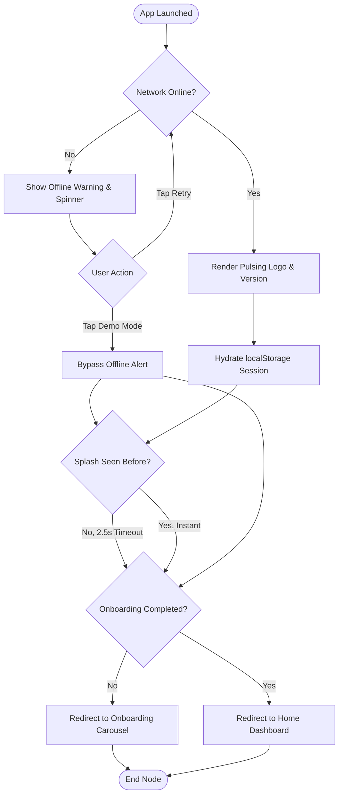

## 5. Frontend & Backend Responsibilities
- **Frontend:** Listens to `window` online/offline events; renders pulsing shimmers and overlays.
- **Backend:** N/A (startup validation phase).

## 6. API Sequence Diagram
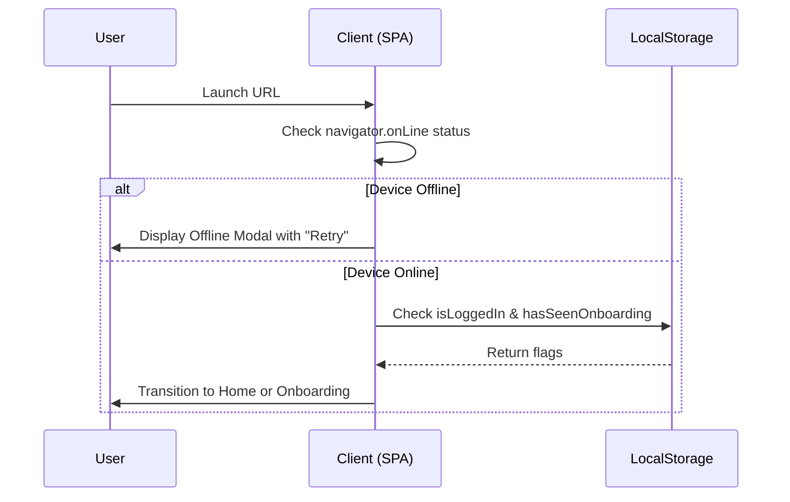

## 7. Edge Cases & Risks
- **Edge Case:** Flapping connection during load. *Mitigation:* App listens to network changes dynamically.
- **Risk:** Session hydration locks due to browser localStorage blockages. *Mitigation:* Hydration-safe client-side check protects UI loads.

## 8. Missing Scenarios & Suggestions
- **Suggestion:** Add an explicit API-driven ping endpoint check rather than relying solely on `navigator.onLine` to identify captive portals (e.g. airport Wi-Fi).

---

# Feature 2: Onboarding Carousel

## 1. Functional Analysis
An interactive introduction demonstrating local pharmacy indexing, cold-chain refrigeration logistics, and digital wallet rewards. Features a language toggle (English/Arabic) in the upper corner and navigation triggers ("Skip" and "Next/Get Started").

## 2. Technical Analysis
- **Entry Points:** Splash screen exit.
- **Exit Points:** Login Panel / Home Page.
- **Component File:** [HomePage](file:///c:/Users/IBRAHIM/Documents/Marketplace_v2/src/app/home/page.js#L548-L616) (rendered as conditional onboarding overlay).
- **State Management:** `showOnboarding` (boolean), `onboardingStep` (integer, 0-2).
- **Behavior:** Slide mirroring for RTL (Right-To-Left) Arabic layouts.

## 3. Business Analysis
- **Purpose:** Educating first-time users on core USPs.
- **User Goal:** Quickly understand application value.
- **Business Goal:** Highlight cold-chain capabilities to promote chronic medicine orders.

## 4. Mermaid Flowchart
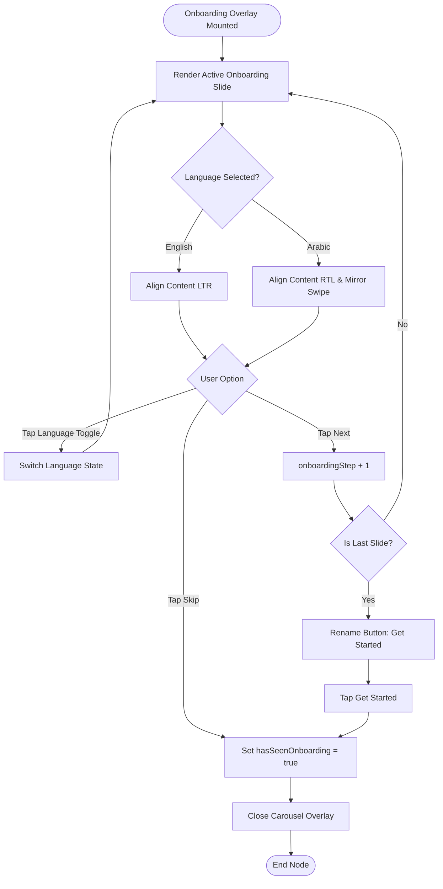

## 5. Frontend & Backend Responsibilities
- **Frontend:** Transitions slides; switches RTL/LTR layout based on active languages.
- **Backend:** N/A.

## 6. API Sequence Diagram
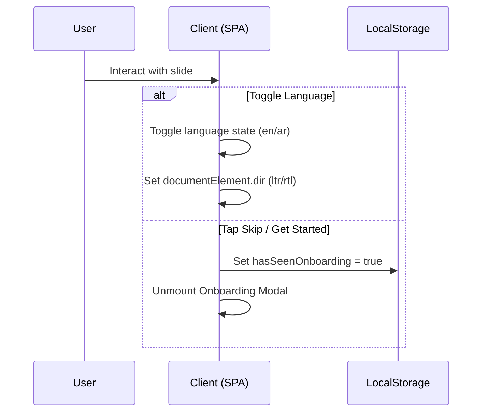

## 7. Edge Cases & Risks
- **Edge Case:** Swipe directions not mirroring properly. *Mitigation:* Explicit `.dir` check changes flex alignments dynamically.

## 8. Missing Scenarios & Suggestions
- **Suggestion:** Cache chosen language immediately to avoid reset on login transitions.

---

# Feature 3: Authentication (Login, Register, OTP & Forgot Password)

## 1. Functional Analysis
Enforces user authentication utilizing Saudi Mobile Numbers (`+966`). Registration validates password complexity rules in real-time. Verification steps are managed via SMS OTP with a countdown retry timer. Forgot Password initiates password resets via SMS codes.

## 2. Technical Analysis
- **Entry Points:** Top Navbar "Login" CTA, Checkout Location/Auth gates.
- **Exit Points:** Home Page (authenticated status) or Checkout Page.
- **Component File:** [AuthModal.js](file:///c:/Users/IBRAHIM/Documents/Marketplace_v2/src/components/AuthModal.js).
- **State Management:** `step` (login, register, otp, forgot, otp-forgot, reset), `otpDigits` (4-digit array), `timer` (OTP resend cooldown).
- **Test Bypass Code:** Code `4921`, `1234`, or `9999` bypasses SMS validation for demonstration.

## 3. Business Analysis
- **Purpose:** Restrict pharmaceutical shopping to registered patients.
- **Business Goal:** Match orders with validated identities in line with MOH prescriptions policies.
- **Regulatory Rules:** Real-time MOH terms acceptance checkpoint during registration.

## 4. Mermaid Flowchart
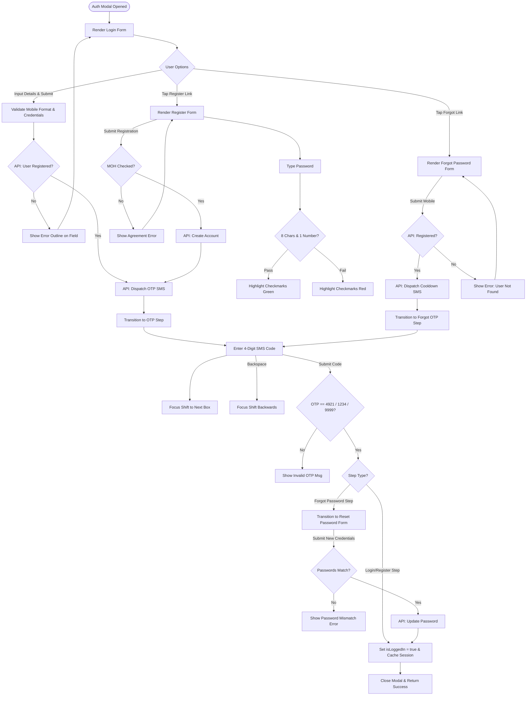

## 5. Frontend & Backend Responsibilities
- **Frontend:** Manages local sub-steps; auto-focuses OTP digits; checks password checks dynamically; sets Saudi code selector.
- **Backend:** Dispatches SMS OTP; confirms hashed credentials; registers user records; issues JWT authorization cookies.

## 6. API Sequence Diagram
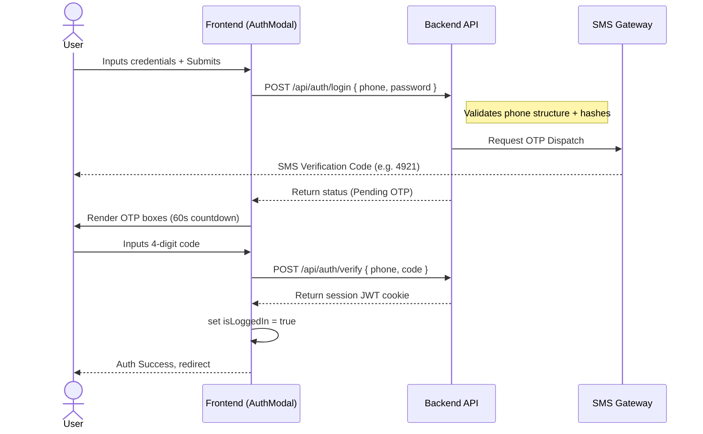

## 7. Edge Cases & Risks
- **Edge Case:** SMS delay. *Mitigation:* Countdown timer locks Resend button for 60 seconds to prevent API spam.
- **Risk:** Scripted brute-forcing of OTP box. *Mitigation:* Bypass limits allow only test codes; production enforces rate limiting.

## 8. Missing Scenarios & Suggestions
- **Suggestion:** Implement native iOS/Android SMS OTP autofill properties (`autocomplete="one-time-code"`).

---

# Feature 4: Home Dashboard & Discovery

## 1. Functional Analysis
The Home Dashboard serves as the content directory:
- Header coordinates delivery location tag selections and updates a notification center.
- Promos slider executes continuous banner transitions.
- Categories grid directs users to listing filters.
- Nearby pharmacies carousel indexes local branches by proximity.
- Best sellers and recently viewed products sections showcase personalized items.

## 2. Technical Analysis
- **Entry Points:** Successful authentication redirect / URL launch.
- **Exit Points:** Search Results Page, Pharmacy storefront, PDP.
- **Component File:** [HomePage](file:///c:/Users/IBRAHIM/Documents/Marketplace_v2/src/app/home/page.js).
- **State Management:** `recentlyViewed` (array of product IDs), `currentAddress` (hydrated active address).

## 3. Business Analysis
- **Purpose:** Core conversion hub.
- **User Goal:** Quickly search items, find local pharmacies, and redeem deals.
- **Business Goal:** Personalize item discovery to maximize average order value (AOV).

## 4. Mermaid Flowchart
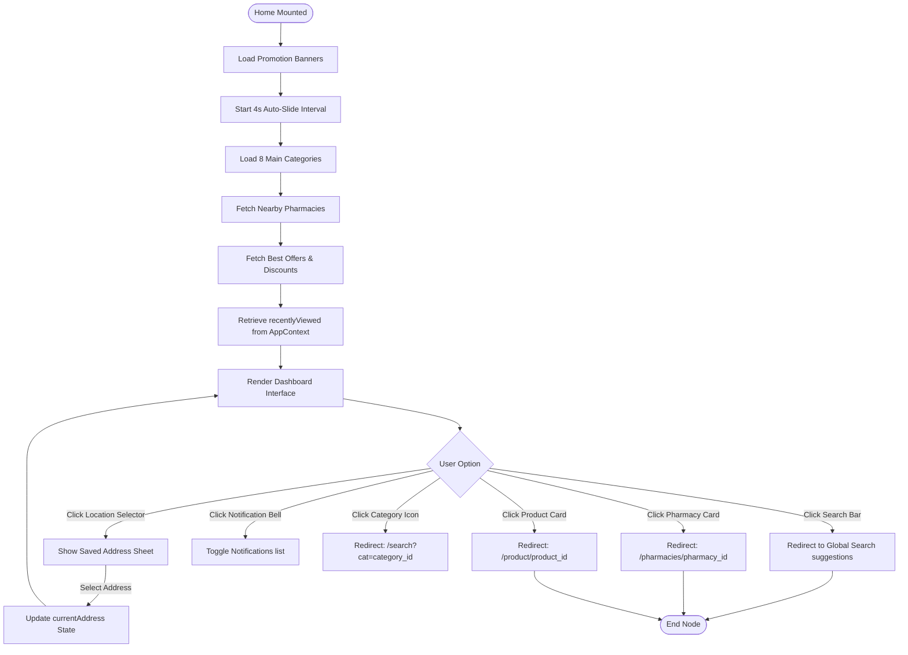

## 5. Frontend & Backend Responsibilities
- **Frontend:** Manages banner slide transitions; displays shimmer loading states; handles local search redirects.
- **Backend:** Resolves user coordinate locations; returns sorted nearby pharmacies; filters personalized best sellers.

## 6. API Sequence Diagram
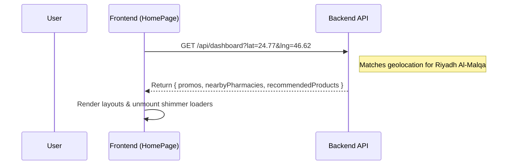

## 7. Edge Cases & Risks
- **Edge Case:** Geolocation lookup timeout. *Mitigation:* Defaults to Riyadh (Al-Malqa) national coordinates.

## 8. Missing Scenarios & Suggestions
- **Suggestion:** Add pull-to-refresh mobile gesture support to reload deals and catalog listings.

---

# Feature 5: Category Catalog

## 1. Functional Analysis
Provides a directory of catalog indexes. A split-column viewport groups parent medical catalog categories on the left, which dynamically update subcategory cards on the right.

## 2. Technical Analysis
- **Entry Points:** Home Navbar "View All" categories CTA.
- **Exit Points:** Product Listing Page (PLP) / Search results.
- **Component File:** [CategoriesPage](file:///c:/Users/IBRAHIM/Documents/Marketplace_v2/src/app/categories/page.js).
- **State Management:** `activeCat` (string, defaults to "medications").

## 3. Business Analysis
- **Purpose:** Organic catalog search catalog indexing.
- **User Goal:** Navigate catalog indexes without typing search queries.
- **Business Goal:** Clean navigation catalog directory representation.

## 4. Mermaid Flowchart
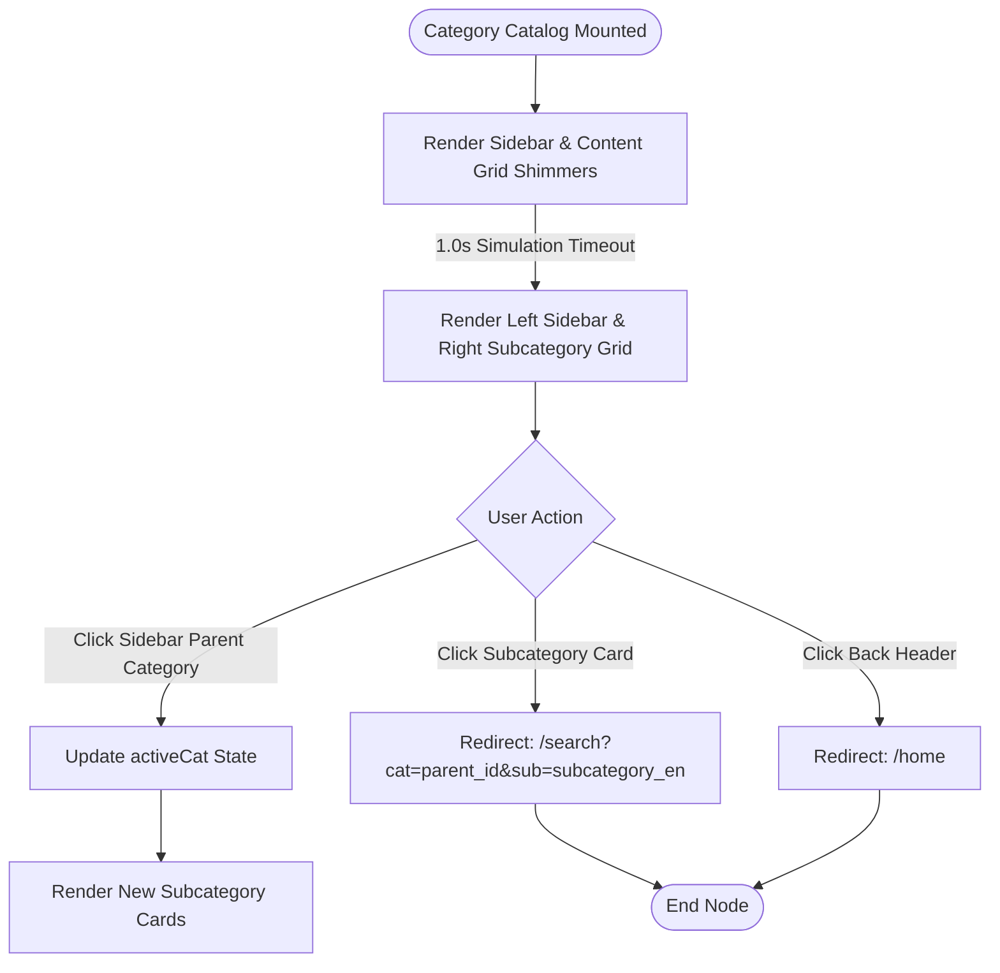

---

# Feature 6: Global Search, PLP & Advanced Filters

## 1. Functional Analysis
Enables users to search products and pharmacies:
- Tracks recent queries.
- Incorporates trending tags.
- Provides barcode scanning triggers.
- Search results split into "Products" and "Pharmacies" tabs.
- Incorporates filters for prices, specific pharmacies, brand criteria, and Rx requirements.
- Features sorting (Low-to-high, high-to-low, best rating).

## 2. Technical Analysis
- **Entry Points:** Search input field inside home dashboard/header.
- **Exit Points:** PDP, Pharmacy storefront profile.
- **Component File:** [SearchContent](file:///c:/Users/IBRAHIM/Documents/Marketplace_v2/src/app/search/page.js).
- **State Management:** `query` (search string), `activeTab` ("products"/"pharmacies"), price inputs, tag selection arrays (`selectedBrands`, `selectedPharmacies`), `rxFilter` ("all"/"rx"/"otc").

## 3. Business Analysis
- **Purpose:** Core search validation funnel.
- **Business Goal:** Direct buyers to available inventory quickly.
- **Regulatory Rules:** Explicit Rx/Prescription badges highlight legal gating rules.

## 4. Mermaid Flowchart
```mermaid
flowchart TD
    Start([Search Screen Loaded]) --> CheckURLParameters[Parse Search URL parameters]
    CheckURLParameters --> FetchQueryHistory[Load Recent Search Terms]
    
    FetchQueryHistory --> SearchInputStatus{Search Query Input?}
    
    SearchInputStatus -- Empty Input -- ShowHistoryTrending[Render Recent Queries & Trending Tags]
    SearchInputStatus -- Typing Query -- QuerySuggestions[API: Fetch Autocomplete Suggestions] --> ShowSuggestions[Render Suggestion list]
    
    ShowHistoryTrending --> TapTerm[Tap Search Tag / Enter Term] --> ProcessSearch[Add Query to history & Execute API Search]
    ShowSuggestions --> TapSuggestion[Tap Suggestion Card] --> ProcessSearch
    
    ProcessSearch --> LoadResults[API: Fetch Matching Products & Vendors]
    LoadResults --> RenderSearchTabs[Render Products vs. Pharmacies Tabs]
    
    RenderSearchTabs --> SelectionTab{Active View Tab?}
    
    SelectionTab -- Pharmacies Tab --> FilterPharmaciesList[Filter Pharmacy matches] --> RenderPharmacies[Render Pharmacy cards]
    
    SelectionTab -- Products Tab --> ApplyActiveFilters[Apply Price, Brand, Pharmacy & Rx Filters]
    ApplyActiveFilters --> ApplySorting[Apply Sort: price, rating, reviews]
    ApplySorting --> CheckResultsEmpty{Results List Empty?}
    
    CheckResultsEmpty -- Yes --> ShowNoResults[Render 'No Results found' alternative options]
    CheckResultsEmpty -- No --> RenderProducts[Render Products grid]
    
    RenderProducts --> ProductAction{User Option}
    ProductAction -- Tap Filter Drawer button --> ShowFilterSheet[Open Bottom sheet Filter Options]
    ShowFilterSheet -- Update Filter Choices --> ApplyActiveFilters
    
    ProductAction -- Click Add to Cart --> ValidateRxGating{Is Rx Medication?}
    ValidateRxGating -- Yes --> RedirectPDP[Redirect to PDP for Prescription Upload]
    ValidateRxGating -- No --> CartAdd[Insert to AppContext Cart]
    
    CartAdd --> SuccessToast[Display Add to Cart Toast]
```

## 5. Frontend & Backend Responsibilities
- **Frontend:** Manages local sorting; updates checked checkboxes; updates URL search parameters; manages responsive filter drawers.
- **Backend:** Fuzzy search logic; processes matches by prefix matching; returns categorized index counts.

## 6. API Sequence Diagram
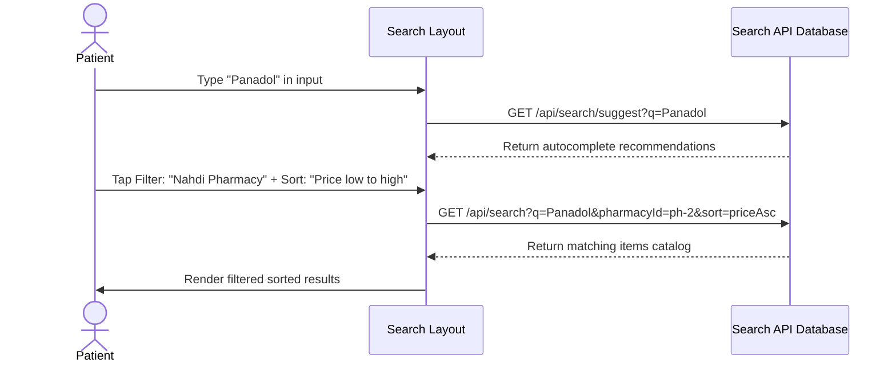

---

# Feature 7: Product Details & POM/Rx Safety Gating

## 1. Functional Analysis
Details product dosages, warnings, and ingredients in accordion lists. Displays guaranteed expiries and alternative sellers. If the item is marked as a Prescription-Only Medicine (POM/Rx):
- Standard "Add to Cart" is gated.
- A red alert warns the user.
- Floating CTA changes to "Upload Prescription".
- Launches a Chatbot Helpline to consult with a licensed pharmacist.

## 2. Technical Analysis
- **Entry Points:** Product listings.
- **Exit Points:** Shopping Cart Page / Back to list.
- **Component File:** [ProductDetailPage](file:///c:/Users/IBRAHIM/Documents/Marketplace_v2/src/app/product/%5Bid%5D/page.js).
- **State Management:** `selectedVendorId` (dynamically updates pricing variables), `isPrescriptionLinked`, `showRxModal` (controls prescription upload overlay).

## 3. Business Analysis
- **Purpose:** Strict pharmaceutical compliance interface.
- **User Goal:** View detailed instructions and upload medical approvals.
- **Business Goal:** Securely sell POM items while maintaining legal compliance.
- **Regulatory Rules:** Safety certification warnings from SFDA must be displayed for Rx items.

## 4. Mermaid Flowchart
```mermaid
flowchart TD
    Start([PDP Mounted]) --> LoadPDPData[Fetch Product Details]
    LoadPDPData --> RenderPDPLayout[Render Gallery, Description Accordions & Seller Picker]
    
    RenderPDPLayout --> CheckRxMedication{Is Prescription Item Rx?}
    
    CheckRxMedication -- Yes --> ShowRxAlert[Render Red Rx Warning Alert] --> AdjustFloatingCTA[Change CTA to Upload Prescription]
    CheckRxMedication -- No --> ShowStandardPricing[Render Standard Price Tags] --> ShowStandardCTA[Render Standard Add to Cart CTA]
    
    AdjustFloatingCTA --> PDPInteraction{User Options}
    ShowStandardCTA --> PDPInteraction
    
    PDPInteraction -- Select Alternative Seller --> UpdatePricing[Update Product Price to Selected Vendor] --> RenderPDPLayout
    PDPInteraction -- Click Ask Pharmacist --> OpenHelperDrawer[Open chat helpline drawer]
    OpenHelperDrawer --> TypeQuestions[Interact with Chatbot Doctor Hisham]
    
    PDPInteraction -- Click Add to Cart -- OTC --> ProcessAddToCart[Add item directly to AppContext Cart]
    
    PDPInteraction -- Click Add to Cart -- Rx Item --> CheckActiveRxAttached{Is Prescription File Attached?}
    
    CheckActiveRxAttached -- Yes --> ProcessAddToCart
    CheckActiveRxAttached -- No --> TriggerRxModal[Open Prescription Selection Modal]
    
    TriggerRxModal --> ChooseUploadMethod{Upload Method}
    ChooseUploadMethod -- Select File/Camera --> InputFile[Choose Image/PDF] --> ConfirmAttachment[Attach fileName to product details]
    ChooseUploadMethod -- Digital Link --> FetchSehaty[API Query MOH Sehaty database] --> SelectDigitalRx[Select active prescription card] --> ConfirmAttachment
    
    ConfirmAttachment --> AddCustomCart[Add item and attached Rx to Cart] --> ShowCartSuccess[Show Cart Success Alert]
```

## 5. Frontend & Backend Responsibilities
- **Frontend:** Locks checkout/cart buttons based on Rx status; coordinates pharmacist chatbot helper questions; manages alternative pricing calculations.
- **Backend:** Performs coordinate checks to confirm vendor stock; retrieves valid prescriptions from the MOH Sehaty database via National ID.

## 6. API Sequence Diagram
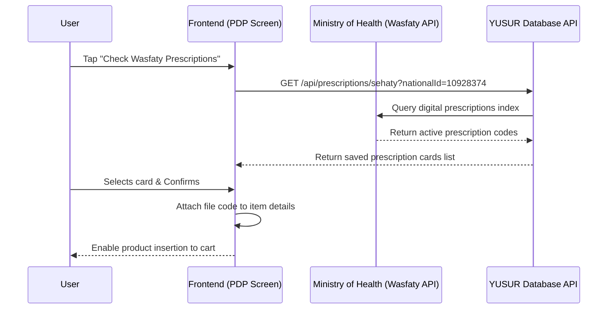

## 7. Edge Cases & Risks
- **Edge Case:** Pharmacy closed. *Mitigation:* Store closed simulated gating disables cart actions and shows a warning banner.
- **Risk:** Expired prescription. *Mitigation:* The backend validates prescription dates during order processing.

## 8. Missing Scenarios & Suggestions
- **Suggestion:** Add warnings for therapeutic duplications (e.g. alert if trying to add two different brands containing Paracetamol to the cart).

---

# Feature 8: Unified Multi-Vendor Shopping Cart

## 1. Functional Analysis
Aggregates cart items and groups them by pharmacy. Features include quantity adjustments, trash triggers, progression bars towards free delivery targets, split shipping cost breakout overlay, and modal sheets to upload or link digital Wasfaty prescriptions.

## 2. Technical Analysis
- **Entry Points:** Top navigation links / PDP successes.
- **Exit Points:** Secure Checkout Page.
- **Component File:** [CartPage](file:///c:/Users/IBRAHIM/Documents/Marketplace_v2/src/app/cart/page.js).
- **Calculations:**
  - Standard Delivery Fee: 10 SAR per pharmacy.
  - Cold-Chain Delivery Fee: 25 SAR per pharmacy (for items like insulin).
  - Free Delivery Threshold: Subtotal >= 100 SAR (per pharmacy group).

## 3. Business Analysis
- **Purpose:** Consolidated invoice manager.
- **User Goal:** Review items, identify shipping fees, and attach doctor approvals.
- **Business Goal:** Encourage cart consolidation (subtotal >= 100 SAR) to reduce delivery logistics costs.

## 4. Mermaid Flowchart
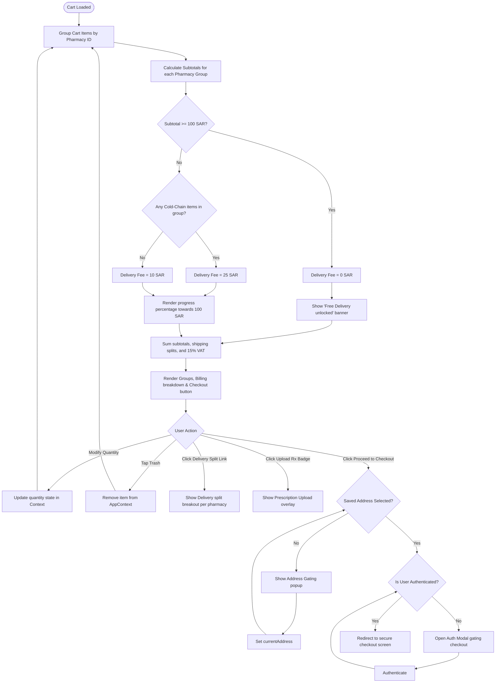

## 5. Frontend & Backend Responsibilities
- **Frontend:** Groups items dynamically; calculates progress bar percentages; opens prescription modals; updates context states.
- **Backend:** Calculates real-time delivery fee overrides based on active courier availability.

## 6. Edge Cases & Risks
- **Edge Case:** Mixed cold chain items. *Mitigation:* If any item in a group requires refrigeration, the entire group upgrades to insulated cold-chain delivery.

---

# Feature 9: Secure Checkout & Scenario Engine

## 1. Functional Analysis
Secure checkout handles delivery confirmation, payment methods, wallet balances, loyalty points, coupons, and SFDA certifications. Incorporates an **Evaluation Toggle** to simulate review scenarios:
- **Scenario A (Partial Approval):** Whites Pharmacy rejects due to out-of-stock, while Nahdi/Al-Dawaa approve.
- **Scenario B (Full Rejection):** All pharmacies reject the order.
- **Scenario C (Full Approval):** All pharmacies approve the order.

## 2. Technical Analysis
- **Entry Points:** Cart proceed verification.
- **Exit Points:** Active orders dashboard / Home Page.
- **Component File:** [CheckoutPage](file:///c:/Users/IBRAHIM/Documents/Marketplace_v2/src/app/checkout/page.js).
- **State Machine Steps:** `review` -> `processing_approval` -> `approval_status` / `rejection_status` -> `payment` -> `processing_payment` -> `confirmation` -> `tracking`.
- **Loyalty Point Conversion Rate:** 50 points = 1 SAR cashback.

## 3. Business Analysis
- **Purpose:** Transaction settlement.
- **User Goal:** Authenticate legal approvals, apply discounts, and complete payments.
- **Business Goal:** Minimize checkout friction while complying with Saudi payment regulations (Mada, Apple Pay) and pharmaceutical distribution checks.

## 4. Mermaid Flowchart
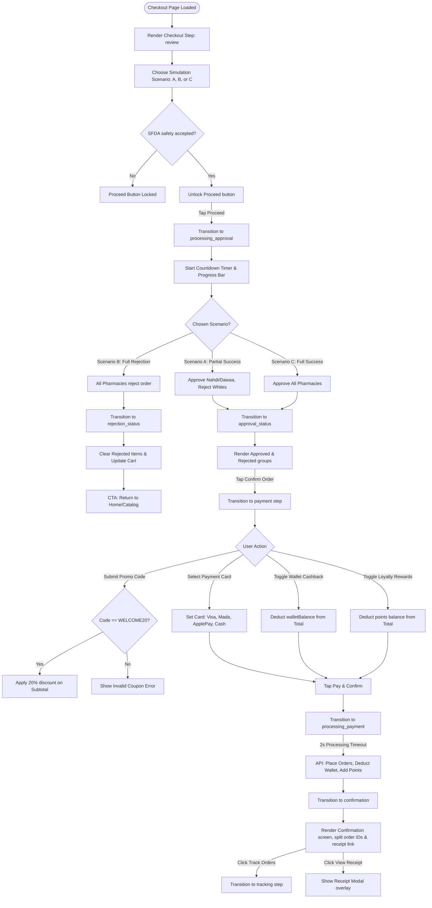

## 5. Frontend & Backend Responsibilities
- **Frontend:** Manages step-based views; handles simulation scenarios; calculates wallet deductions; converts loyalty points; validates promo codes.
- **Backend:** Handles split payment processing; adjusts client wallets; awards loyalty points; updates inventory levels.

## 6. API Sequence Diagram
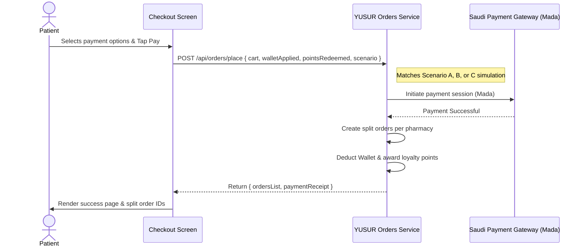

## 7. Edge Cases & Risks
- **Edge Case:** Wallet balance is larger than order totals. *Mitigation:* Wallet deductions are capped at the total payable value, leaving a 0 SAR net card charge.
- **Risk:** Failed card authentication. *Mitigation:* Checkout step transitions back to payment selection, preserving cart contents.

## 8. Missing Scenarios & Suggestions
- **Suggestion:** Add an explicit Tabby/Tamara split payment simulator, as installment plans are common in Saudi e-commerce.

---

# Feature 10: Orders & Live Delivery Tracking

## 1. Functional Analysis
Organizes active deliveries and completed order history. Active order tracking includes:
- Live progress timeline map pins.
- Milestone stepper tracker (Placed -> Preparing -> Out for Delivery -> Arrived).
- Courier driver details.
- Licensed pharmacist helpline consultation banners.

## 2. Technical Analysis
- **Entry Points:** Bottom navigation links / Checkout confirmation success page.
- **Exit Points:** Details PDP / Home.
- **Component File:** [OrdersPage](file:///c:/Users/IBRAHIM/Documents/Marketplace_v2/src/app/orders/page.js).
- **State Management:** `activeTab` ("active"/"history"), `trackingOrder` (order object).

## 3. Business Analysis
- **Purpose:** Post-purchase trust verification.
- **User Goal:** Monitor package arrivals and request medical guidance.
- **Business Goal:** Reduce delivery inquiries (Where is my order?) through transparent tracking.

## 4. Mermaid Flowchart
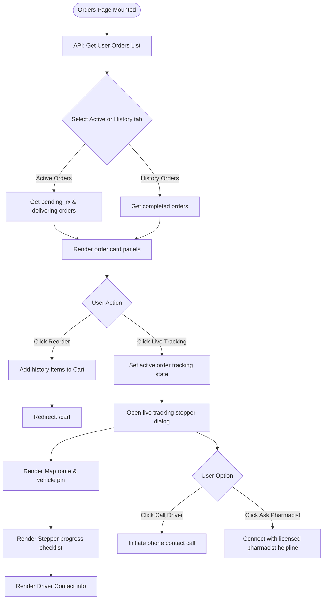

## 5. Frontend & Backend Responsibilities
- **Frontend:** Updates stepper indicator progress states; triggers phone dialers; renders map pins.
- **Backend:** Dispatches real-time GPS locations; updates milestone progress states.

## 6. API Sequence Diagram
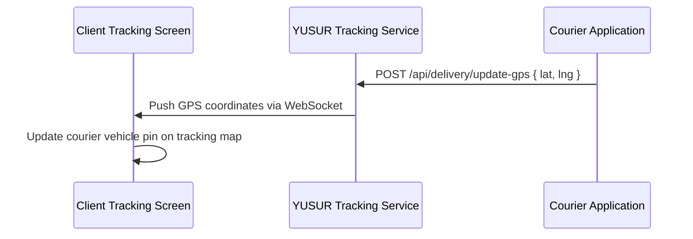

---

# Feature 11: Profile, Geolocation Map Dropper & Account Management

## 1. Functional Analysis
The Profile Dashboard organizes settings, saved addresses, wishlist items, saved cards, and policy directories. The saved address picker provides:
- A draggable map interface to drop pins.
- Geolocation coordinate fetchers.
- Inputs for street details, building numbers, national address codes, and delivery notes.

## 2. Technical Analysis
- **Entry Points:** Profile navigation tab.
- **Exit Points:** Home Page.
- **Component File:** [ProfileContent](file:///c:/Users/IBRAHIM/Documents/Marketplace_v2/src/app/profile/page.js).
- **State Management:** `activePanel` (profile, addresses, wishlist, support, wallet, payment, privacy), `addresses` (array), `isAddingAddress` (boolean).

## 3. Business Analysis
- **Purpose:** User account and address book management.
- **User Goal:** Set delivery address pins accurately and manage payment methods.
- **Business Goal:** Ensure delivery address accuracy to prevent delivery failures.

## 4. Mermaid Flowchart
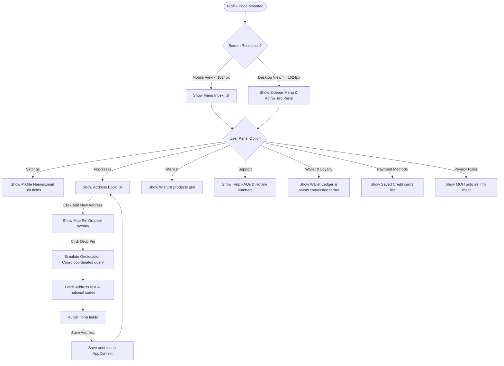

## 5. Frontend & Backend Responsibilities
- **Frontend:** Operates map rendering; performs client-side validation; updates language toggles.
- **Backend:** Converts coordinates to street addresses (reverse geocoding); saves profiles; manages payment tokens.

## 6. API Sequence Diagram
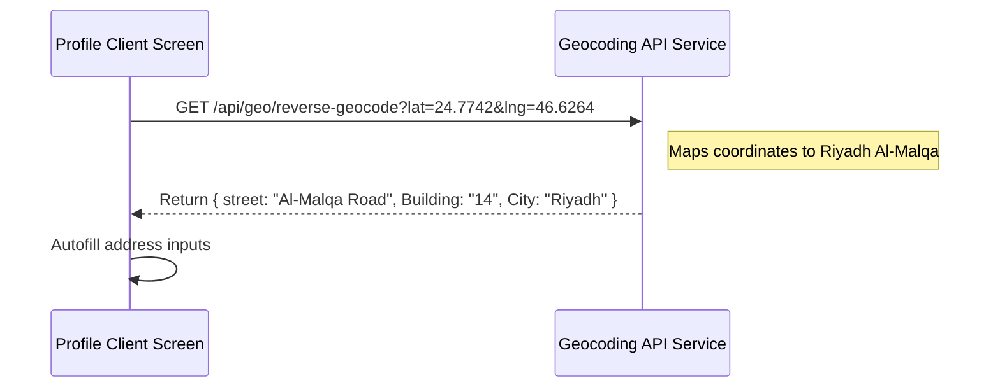

## 7. Edge Cases & Risks
- **Edge Case:** Geolocation returns empty address data. *Mitigation:* Falls back to manual address entry fields.

## 8. Missing Scenarios & Suggestions
- **Suggestion:** Add biometric validation (FaceID/TouchID) for fast checkouts and card lookups.

---

## 3. Comprehensive Solution Architecture Review

| Architecture Review Area | Status & Observations | Risks & Debts |
| :--- | :--- | :--- |
| **Folder Structure** | Standard Next.js App Router layout (`src/app/`, `src/components/`, `src/context/`, `src/mock/`). | Pages like `checkout/page.js` and `profile/page.js` are large (70KB-80KB) and should be split into smaller sub-components. |
| **State Management** | Centralized context (`AppContext.js`) maps global variables (cart, wallet, loyalty points). | Context re-renders the entire app on any cart change. Recommend moving state to Zustand for optimized rendering. |
| **Routing** | App Router redirects `/` to `/home` properly. | Deep dynamic route structures should utilize layout sub-files for route protection. |
| **Performance** | Simulated client-side shimmers improve perceived performance. | Large code bundles can delay initial loads on slow networks. |
| **Security** | Auth bypass codes (`4921`) are explicitly exposed. | Ensure bypass codes are removed in production environments. |
| **Caching** | `sessionStorage`/`localStorage` caching for onboarding and splash pages. | Clear cache management triggers are required for user logs. |
| **Error Handling** | Splash and checkout steps check connection status and API failures. | Explicit global Next.js boundary handlers (`error.js`) need implementation. |

---

## 4. Operational Responsibilities Summary

### Frontend Responsibilities
1. **Dynamic Groupings:** Group cart and checkout items by pharmacy branch ID.
2. **Delivery Progress Meters:** Calculate progress percentages for free shipping on orders over 100 SAR.
3. **Prescription Rules:** Enforce POM/Rx warnings and lock add-to-cart actions unless a prescription file is uploaded or linked.
4. **Checkout Scenario Selection:** Handle scenario simulations (rejection, partial approval, full success) to update local states dynamically.
5. **Language Direction:** Update `document.documentElement.dir` (`rtl`/`ltr`) when switching languages.
6. **Geolocation & Map Pin Dropping:** Handle map visual displays and coordinate updates.

### Backend Responsibilities
1. **Split Fulfillment:** Receive split orders and coordinate fulfillment schedules with individual pharmacies.
2. **Prescription Integrations:** Query MOH database structures to verify patient prescriptions.
3. **Loyalty Conversions:** Enforce the 50 points = 1 SAR conversion rate and adjust wallets securely.
4. **Fuzzy Search:** Filter product catalog requests and return sorted near-me vendor indexes.
5. **Security tokens:** Issue secure JWT validation tokens and enforce API rate limits.

---

## 5. Sequence Diagram: Consolidated Checkout & Simulation Engine

```mermaid
sequenceDiagram
    autonumber
    actor Patient
    participant FE as Secure Checkout Screen
    participant BE as YUSUR Core Service
    participant MOH as MOH database (Sehaty)
    participant Pharm as Pharmacy Vendor Terminal
    participant PG as Payment Gateway
    
    Patient->>FE: Review items & Select Scenario A (Partial)
    FE->>FE: Verify SFDA Accept Checkbox Checked
    FE->>BE: POST /api/orders/verify-prescription { cart }
    BE->>MOH: Cross-reference attached prescription files
    MOH-->>BE: Validate prescription authentic ✓
    BE-->>FE: Prescription OK
    Patient->>FE: Tap Continue to Pharmacy Review
    FE->>FE: Transition step: processing_approval
    FE->>BE: POST /api/checkout/simulate-review { cart, scenario: "partial_success" }
    
    rect rgb(240, 240, 240)
        Note over BE, Pharm: Simulation loops matching Scenario A
        BE->>Pharm: Request stock checks
        Pharm-->>BE: Al-Dawaa/Nahdi: STOCK APPROVED
        Pharm-->>BE: Whites Pharmacy: REJECTED (Out of stock)
    end
    
    BE-->>FE: Return review results
    FE->>FE: Transition step: approval_status
    FE->>Patient: Display Approved list & Rejected warnings
    Patient->>FE: Tap Continue to Payment
    FE->>FE: Transition step: payment
    Patient->>FE: Toggle: Use Wallet & Redeem Loyalty
    FE->>FE: Calculate net payable total
    Patient->>FE: Select: Mada Card & Tap Pay
    FE->>FE: Transition step: processing_payment
    FE->>BE: POST /api/checkout/pay { orderTotal, paymentMethod: "mada" }
    BE->>PG: Auth card credentials (Mada)
    PG-->>BE: Authorization Success ✓
    BE->>BE: Create Order YS-812 (Al-Dawaa)
    BE->>BE: Create Order YS-813 (Nahdi)
    BE->>BE: Refund Whites rejected items back to Wallet
    BE->>BE: Award loyalty points & clear Cart
    BE-->>FE: Return split Order IDs & Receipt PDF
    FE->>FE: Transition step: confirmation
    FE->>Patient: Render Confirmation screen with Receipt
```

---

## 6. Risks, Recommendations & Improvement Plans

1. **Client-Side Simulation Exposure**
   - **Risk:** Scenario simulation parameters and bypass codes are handled on the client side.
   - **Recommendation:** Move simulation logic to server-side mock microservices to prevent leaks.
2. **Context Render Bottlenecks**
   - **Risk:** Large cart arrays trigger full app re-renders on quantity updates.
   - **Recommendation:** Migrate state to Zustand or Redux Toolkit to isolate state updates.
3. **Biometric Authentication**
   - **Risk:** Manual credential entry during gated checkout checks.
   - **Recommendation:** Implement WebAuthn parameters to support FaceID/TouchID in KSA.
4. **Therapeutic Duplication Checks**
   - **Risk:** Patients can order conflicting medications simultaneously.
   - **Recommendation:** Implement automated checks during prescription review to alert users of potential conflicts.
